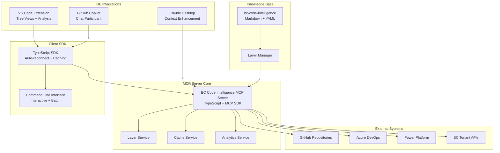
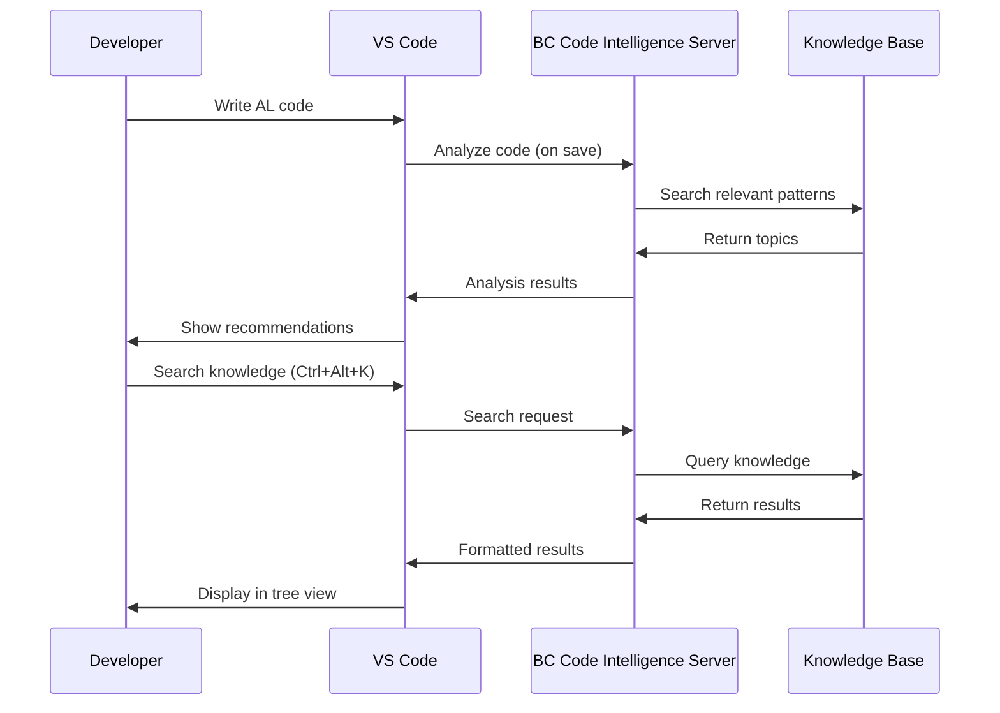
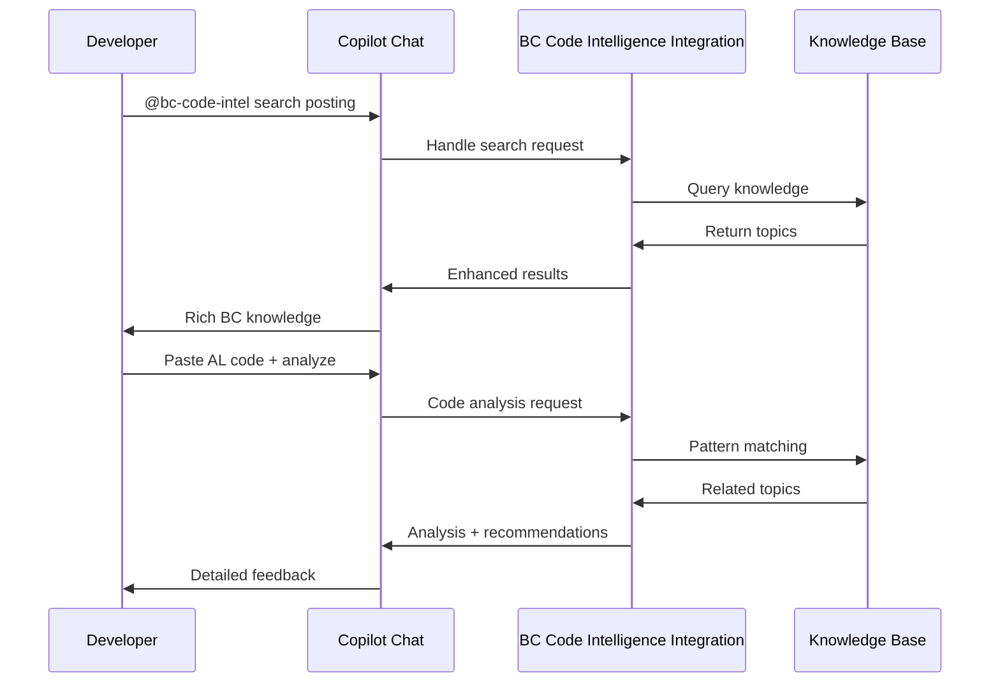
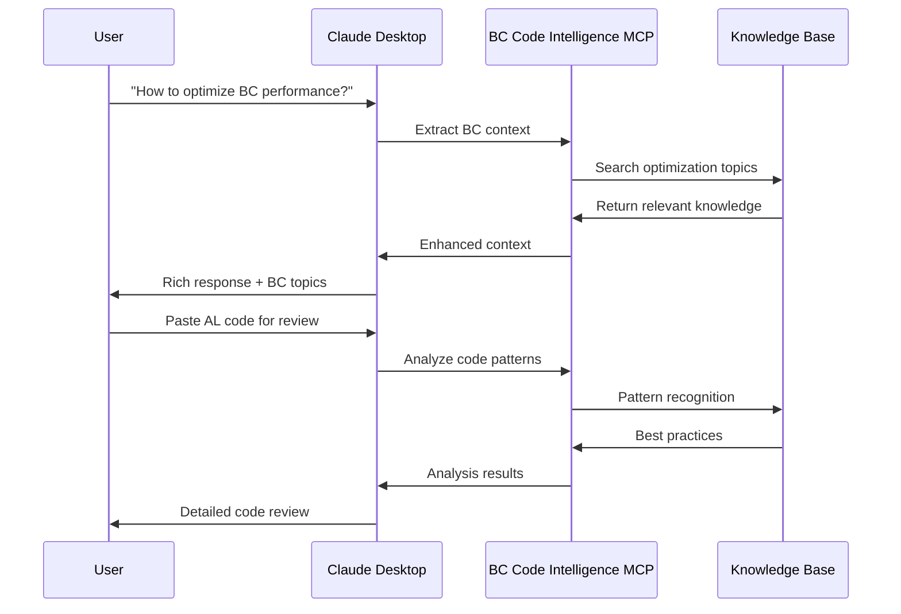

# BC Code Intelligence Integration Ecosystem

## Overview

The BC Code Intelligence MCP Server provides a comprehensive integration ecosystem that enables seamless access to BC knowledge across multiple development environments and tools.

## Architecture



## Integration Components

### 1. TypeScript SDK (`src/sdk/bc-code-intel-client.ts`)

**Purpose**: Type-safe client library for connecting to BC Code Intelligence MCP servers

**Key Features:**
- Intelligent caching with configurable TTL
- Auto-reconnection with exponential backoff
- Event-driven architecture for real-time updates
- Batch operations for efficiency
- Comprehensive error handling

**Usage Example:**
```typescript
import { BCCodeIntelClient, BCCodeIntelClientDefaults } from './sdk/bc-code-intel-client.js';

const client = new BCCodeIntelClient(BCCodeIntelClientDefaults.local());
await client.connect();

const topics = await client.searchTopics('posting routines', {
  domain: 'finance',
  difficulty: 'intermediate',
  limit: 5
});

const analysis = await client.analyzeCode({
  code_snippet: alCodeSnippet,
  analysis_type: 'performance',
  suggest_topics: true
});
```

### 2. Command Line Interface (`src/cli/bc-code-intel-cli.ts`)

**Purpose**: Developer-friendly CLI for testing, automation, and batch operations

**Commands:**
- `bc-code-intel search` - Search knowledge topics with filters
- `bc-code-intel get` - Retrieve specific topic details
- `bc-code-intel analyze` - Analyze AL code files or snippets
- `bc-code-intel status` - Check server health and statistics
- `bc-code-intel config` - Manage server configuration
- `bc-code-intel interactive` - Start interactive session

**Usage Example:**
```bash
# Search for topics
bc-code-intel search "table relationships" --domain sales --limit 10

# Analyze AL code file
bc-code-intel analyze --file MyCodeunit.al --type performance --json

# Interactive mode
bc-code-intel interactive
bc-code-intel> search posting patterns
bc-code-intel> analyze var customerRec: Record Customer;
bc-code-intel> exit
```

### 3. VS Code Extension (`vscode-extension/`)

**Purpose**: Integrated BC knowledge access within VS Code

**Features:**
- **Knowledge Tree View**: Browse topics by domain and difficulty
- **Search Results Panel**: Interactive search with filtering
- **Code Analysis**: Right-click analysis of selected AL code
- **Recommendations Panel**: Context-aware topic suggestions
- **Status Monitoring**: Real-time server health display
- **Quick Actions**: Keyboard shortcuts and commands

**Installation:**
```bash
# Package the extension
cd vscode-extension
npm install
npm run compile
vsce package

# Install in VS Code
code --install-extension bc-code-intel-knowledge-assistant-1.0.0.vsix
```

### 4. GitHub Copilot Integration (`integrations/copilot/`)

**Purpose**: Enhanced Copilot Chat with BC-specific knowledge

**Capabilities:**
- **@bc-code-intel search**: Direct knowledge search within Copilot Chat
- **Code Analysis**: Automatic BC pattern recognition
- **Smart Suggestions**: Context-aware recommendations
- **Explanation Enhancement**: Detailed BC concept explanations
- **Best Practice Guidance**: Real-time development assistance

**Usage Example:**
```
// In Copilot Chat
@bc-code-intel search posting procedures in purchase domain

@bc-code-intel analyze this codeunit for performance issues:
[paste AL code]

@bc-code-intel explain table relationships in BC
```

### 5. Claude Desktop Integration (`integrations/claude-desktop/`)

**Purpose**: Seamless BC knowledge integration in Claude conversations

**Features:**
- **Context-Aware Enhancement**: Automatic BC knowledge supplements
- **Conversation Analysis**: Extract BC concepts and provide relevant topics
- **Code Review Integration**: Enhanced AL code analysis
- **Smart Recommendations**: Proactive learning suggestions
- **Performance Monitoring**: Integration health and metrics

**Configuration:**
```json
{
  "mcpServers": {
    "bc-code-intel": {
      "command": "node",
      "args": ["dist/index.js"],
      "env": {
        "BC_CODE_INTEL_LOG_LEVEL": "info",
        "BC_CODE_INTEL_CACHE_ENABLED": "true"
      }
    }
  }
}
```

## Development Workflow Integration

### 1. VS Code Development Flow



### 2. Copilot-Enhanced Development



### 3. Claude Desktop Conversation Enhancement



## Configuration Management

### Environment Variables

```bash
# Core Settings
BC_CODE_INTEL_LOG_LEVEL=info|debug|warn|error
BC_CODE_INTEL_CACHE_ENABLED=true|false
BC_CODE_INTEL_CACHE_TTL_SECONDS=600

# Layer Configuration
BC_CODE_INTEL_DEBUG_LAYERS=true|false
BC_CODE_INTEL_COMPANY_KNOWLEDGE_URL=https://github.com/company/bc-knowledge
BC_CODE_INTEL_PROJECT_OVERRIDES_PATH=./bc-code-intel-overrides

# Performance Settings
BC_CODE_INTEL_MAX_SEARCH_RESULTS=10
BC_CODE_INTEL_REQUEST_TIMEOUT_MS=10000
BC_CODE_INTEL_CONCURRENT_REQUESTS=5

# Integration Settings
BC_CODE_INTEL_VSCODE_AUTO_ANALYSIS=true|false
BC_CODE_INTEL_COPILOT_ENHANCED_MODE=true|false
BC_CODE_INTEL_CLAUDE_CONTEXT_RETENTION=10
```

### Configuration Validation

```bash
# Validate current configuration
bc-code-intel config --validate

# Reload configuration without restart
bc-code-intel config --reload

# Export configuration analytics
bc-code-intel config --export config-report.json
```

## Monitoring and Analytics

### Health Monitoring

```typescript
// Check integration health
const status = await client.getSystemStatus();
console.log(`Health: ${status.overall_health}`);
console.log(`Active Layers: ${status.layers_active}`);
console.log(`Total Topics: ${status.total_topics}`);
console.log(`Cache Hit Rate: ${status.cache_hit_rate}%`);
```

### Performance Metrics

```typescript
// Get detailed analytics
const analytics = await client.getSystemAnalytics();
console.log('System Overview:', analytics.system_overview);
console.log('Layer Performance:', analytics.layer_performance);
console.log('Usage Patterns:', analytics.usage_patterns);
console.log('Configuration Health:', analytics.configuration_insights);
```

### Telemetry Integration

```typescript
// Custom telemetry events
client.on('search_performed', (event) => {
  // Track search patterns
  console.log(`Search: ${event.query}, Results: ${event.result_count}`);
});

client.on('code_analyzed', (event) => {
  // Track code analysis usage
  console.log(`Analysis: ${event.analysis_type}, Issues: ${event.issue_count}`);
});

client.on('topic_accessed', (event) => {
  // Track knowledge consumption
  console.log(`Topic: ${event.topic_id}, Domain: ${event.domain}`);
});
```

## Security Considerations

### Authentication and Authorization

- **MCP Transport Security**: Encrypted communication channels
- **API Rate Limiting**: Configurable request throttling
- **Knowledge Access Control**: Layer-based permissions
- **Audit Logging**: Comprehensive usage tracking

### Data Protection

```typescript
// Sensitive data handling
const sanitizedConfig = client.getClientConfig(); // Removes debug flags
const exportData = await client.getSystemAnalytics({
  exclude_sensitive_data: true,
  anonymize_queries: true
});
```

### Network Security

```bash
# Configure secure endpoints
export BC_CODE_INTEL_COMPANY_KNOWLEDGE_URL=https://github.com/company/bc-knowledge
export BC_CODE_INTEL_API_TIMEOUT_MS=5000
export BC_CODE_INTEL_MAX_RETRY_ATTEMPTS=3
```

## Deployment Strategies

### Development Environment

```json
{
  "mcpServers": {
    "bc-code-intel": {
      "command": "npm",
      "args": ["run", "dev"],
      "env": {
        "BC_CODE_INTEL_LOG_LEVEL": "debug",
        "BC_CODE_INTEL_DEBUG_LAYERS": "true",
        "BC_CODE_INTEL_CACHE_ENABLED": "false"
      }
    }
  }
}
```

### Production Environment

```json
{
  "mcpServers": {
    "bc-code-intel": {
      "command": "node",
      "args": ["dist/index.js"],
      "env": {
        "BC_CODE_INTEL_LOG_LEVEL": "warn",
        "BC_CODE_INTEL_DEBUG_LAYERS": "false",
        "BC_CODE_INTEL_CACHE_ENABLED": "true",
        "BC_CODE_INTEL_CACHE_TTL_SECONDS": "1800"
      }
    }
  }
}
```

### Enterprise Deployment

```bash
# Docker deployment
docker run -d \
  --name bc-code-intel-server \
  -p 3000:3000 \
  -e BC_CODE_INTEL_LOG_LEVEL=info \
  -e BC_CODE_INTEL_COMPANY_KNOWLEDGE_URL=https://internal-git/bc-knowledge \
  -v ./company-overrides:/app/bc-code-intel-overrides \
  bc-code-intel-server:latest

# Kubernetes deployment
kubectl apply -f k8s/bc-code-intel-deployment.yaml
kubectl expose deployment bc-code-intel-server --type=LoadBalancer --port=3000
```

## Future Roadmap

### Planned Integrations

1. **Azure DevOps Integration**
   - Work item linking with BC knowledge
   - Pipeline integration for code analysis
   - Requirement traceability

2. **Power Platform Connectors**
   - Power Apps canvas app integration
   - Power Automate workflow triggers
   - Power BI embedded analytics

3. **Business Central SaaS Integration**
   - Direct tenant connectivity
   - Real-time telemetry analysis
   - Performance monitoring integration

4. **Microsoft Teams Integration**
   - Bot-based knowledge access
   - Team collaboration features
   - Meeting integration

### Enhancement Areas

- **AI-Powered Recommendations**: Machine learning for topic suggestions
- **Multi-Language Support**: Localized knowledge content
- **Version-Specific Knowledge**: BC version-aware filtering
- **Community Contributions**: Crowd-sourced knowledge updates
- **Advanced Analytics**: Usage pattern analysis and optimization

---

*The BC Code Intelligence Integration Ecosystem provides a comprehensive foundation for BC knowledge access across the entire development lifecycle, from initial learning to production optimization.*
